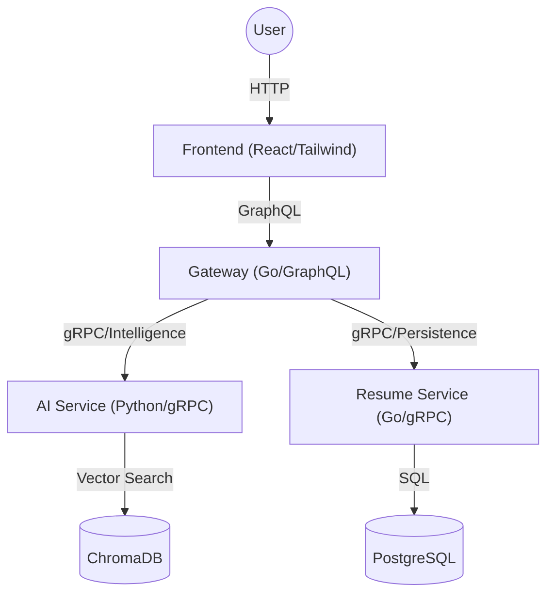

# iProtoResume 🚀

[](https://go.dev/)
[](https://www.python.org/)
[](https://reactjs.org/)
[](https://www.docker.com/)
[](LICENSE)

**iProtoResume** is a production-grade, AI-powered Resume Builder built with a scalable Microservices architecture. It leverages **Google Gemini 1.5** to intelligently tailor your resume to any job description, generating smart cover letters and providing ATS score analysis to maximize interview chances.

---

## ✨ Key Features

- **🤖 AI Resume Tailoring**: Instantly adapts your resume to match job descriptions using semantic analysis.
- **📝 Smart Cover Letters**: Generates professional, editable cover letters tailored to the role (3-paragraph structure).
- **📊 AI ATS Scoring**: Advanced semantic scoring with detailed reasoning, actionable feedback, and keyword gap analysis.
- **👁️ Interactive Preview**: Real-time "Diff" view showing exactly what the AI changed.
- **📄 Professional Templates**: Modern, split-screen designs with PDF export support.
- **🏗️ Microservices**: Scalable architecture separating Persistence (Go) and Intelligence (Python).

---

## 🏗 Architecture

The system follows a refined 3-Service Architecture using Protocol Buffers (gRPC) for efficient communication.



## 🛠 Tech Stack

| Component | Technology | Description |
|-----------|------------|-------------|
| **Frontend** | React, TailwindCSS, Vite | Responsive UI/UX with PDF generation and real-time previews. |
| **Gateway** | Go, gqlgen | GraphQL entry point, request orchestration between services. |
| **AI Service** | Python, gRPC, Gemini, ChromaDB | The "Brain". Handles Tailoring, Scoring, Cover Letters, and RAG. |
| **Resume Service** | Go, gRPC, GORM | The "Vault". Handles data persistence, CRUD operations, and Postgres management. |
| **Data** | PostgreSQL, ChromaDB | Relational User Data & Vector Embeddings. |
| **Infra** | Docker Compose | Optimized for local dev (Apple Silicon/M-series support). |

---

## 🚀 Getting Started

### Prerequisites

- [Go 1.25+](https://go.dev/dl/)
- [Python 3.10+](https://www.python.org/downloads/)
- [Node.js 18+](https://nodejs.org/)
- [Docker Desktop](https://www.docker.com/products/docker-desktop) (Optional)

### Installation

1. **Clone the repository:**
   ```bash
   git clone https://github.com/Kal-T/iProtoResume.git
   cd iProtoResume
   ```

2. **Environment Setup:**
   Copy the example environment file and configure your API keys.
   ```bash
   cp .env.example .env
   # CRITICAL: Edit .env and add your GOOGLE_API_KEY (from Google AI Studio)
   ```

3. **Generate Protocol Buffers:**
   We use a helper Makefile to generate Go and Python code from `.proto` files.
   ```bash
   make proto
   ```
   *(Note: If you encounter Python path issues, refer to `manual_fix_python.md`)*

4. **Start the Stack:**
   
   **Option A: Local Development (Recommended)**
   ```bash
   # Terminal 1: Frontend
   cd frontend && npm install && npm run dev
   
   # Terminal 2: Gateway (Port 8080)
   go run cmd/gateway/main.go
   
   # Terminal 3: Resume Service (Port 50053)
   cd resume-service-go && go run cmd/server/main.go
   
   # Terminal 4: AI Service (Port 50051)
   cd ai-service-python
   # Ensure venv is active and deps installed
   python3 main.py
   ```

   **Option B: Docker Compose**
   ```bash
   docker-compose up --build
   ```

   - **Frontend:** [http://localhost:5173](http://localhost:5173)
   - **Gateway Playground:** [http://localhost:8080](http://localhost:8080)

---

## 📂 Project Structure

```bash
├── frontend/               # React + Tailwind application
├── gateway-go/            # Go GraphQL Gateway (Orchestrator)
├── ai-service-python/     # Python AI Service (The Brain)
├── resume-service-go/     # Go Persistence Service (The Vault)
├── shared/
│   └── proto/             # Protocol Buffer Definitions (.proto)
└── docker-compose.yml     # Infrastructure config
```

## 📜 License

This project is licensed under the MIT License - see the [LICENSE](LICENSE) file for details.
